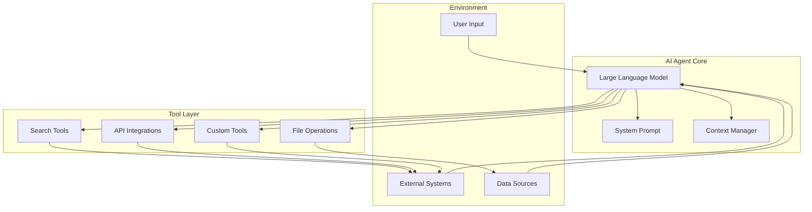
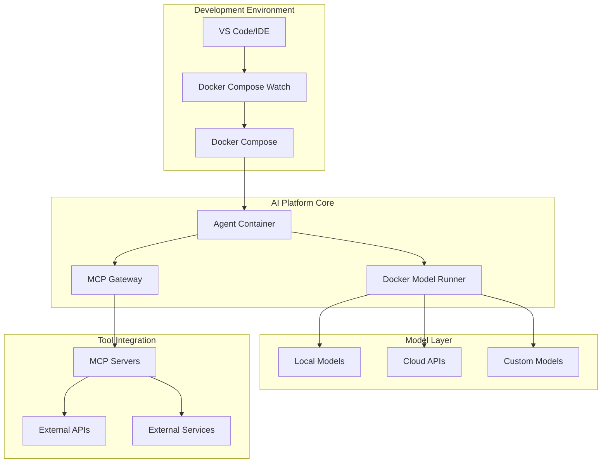
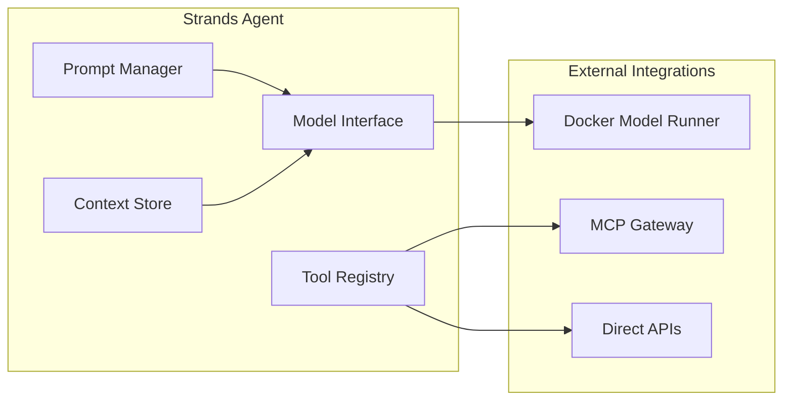

# Module 1: Foundations - AI Agents and Docker AI Platform

## Introduction

Welcome to the Docker AI Agents Workshop! In this foundational module, you'll learn about AI agents, Docker's AI platform, and the Strands SDK that powers modern agent development. By the end of this module, you'll understand the core concepts and have a working development environment ready for building your first AI agent.

## What are AI Agents?

AI agents are autonomous software programs that can perceive their environment, make decisions, and take actions to achieve specific goals. Unlike traditional applications that follow predetermined paths, AI agents can:

- **Reason** about complex problems using large language models
- **Use tools** to interact with external systems and APIs
- **Maintain context** across multiple interactions
- **Adapt** their behavior based on feedback and results

### AI Agent Architecture



### Real-World AI Agent Use Cases

- **Customer Support Agents**: Handle inquiries, access knowledge bases, escalate complex issues
- **Development Assistants**: Write code, run tests, manage deployments
- **Data Analysis Agents**: Query databases, generate reports, identify trends
- **Content Creation Agents**: Research topics, write articles, optimize for SEO
- **System Monitoring Agents**: Watch metrics, diagnose issues, trigger alerts

## Docker's AI Platform

Docker has built a comprehensive AI platform that simplifies the development, deployment, and scaling of AI agents. The platform consists of several key components that work together to provide a seamless development experience.

### Docker AI Platform Architecture



### Docker Model Runner

Docker Model Runner is a containerized service that provides a unified interface for running AI models locally. It offers several key benefits:

**Key Features:**
- **Model Abstraction**: Consistent API regardless of the underlying model
- **Resource Management**: Automatic GPU allocation and memory optimization
- **Model Caching**: Efficient model loading and sharing across containers
- **Hot Swapping**: Switch between models without restarting your application

**Supported Models:**
- Llama 2/3 family models
- Mistral and Mixtral models
- Code-specific models like CodeLlama
- Custom fine-tuned models

**Example Configuration:**
```yaml
services:
  model-runner:
    image: docker/model-runner:latest
    ports:
      - "11434:11434"
    volumes:
      - model-cache:/root/.ollama
    environment:
      - OLLAMA_MODELS=/root/.ollama/models
```

### MCP Gateway

The Model Context Protocol (MCP) Gateway provides secure, standardized access to external tools and services. It acts as a bridge between your AI agent and the outside world.

**Security Benefits:**
- **Sandboxed Execution**: Tools run in isolated containers
- **Permission Management**: Fine-grained control over tool access
- **Secret Management**: Secure handling of API keys and credentials
- **Audit Logging**: Complete visibility into tool usage

**Common MCP Tools:**
- **Search Tools**: Web search, documentation search
- **File Operations**: Read, write, and manipulate files
- **Database Access**: Query databases securely
- **API Integrations**: REST APIs, GraphQL endpoints
- **System Operations**: Execute commands, manage processes

**Example MCP Configuration:**
```yaml
services:
  mcp-gateway:
    image: docker/mcp-gateway:latest
    ports:
      - "3000:3000"
    environment:
      - MCP_SERVERS=search,filesystem,database
    secrets:
      - api_keys
```

### Docker Compose Watch

Docker Compose Watch enables hot reload functionality for rapid development cycles. It automatically rebuilds and restarts services when code changes are detected.

**Development Benefits:**
- **Instant Feedback**: See changes immediately without manual restarts
- **Preserved State**: Maintain agent context during development
- **Efficient Rebuilds**: Only rebuild changed components
- **Multi-Service Coordination**: Coordinate updates across dependent services

**Example Watch Configuration:**
```yaml
services:
  agent:
    build: .
    develop:
      watch:
        - action: rebuild
          path: ./src
        - action: sync
          path: ./config
          target: /app/config
```

## Strands SDK: Model-Driven Philosophy

The Strands SDK embodies a model-driven approach to AI agent development, emphasizing simplicity, composability, and best practices. It provides a clean abstraction layer that makes building sophisticated agents accessible to developers of all skill levels.

### Core Philosophy

**Model-First Design**: Everything starts with the language model as the central reasoning engine. Tools, prompts, and context are all designed to enhance the model's capabilities.

**Composable Architecture**: Agents are built from reusable components that can be mixed and matched:
- **Models**: The reasoning engine (local or cloud-based)
- **Tools**: Capabilities the agent can use
- **Prompts**: Instructions that guide agent behavior
- **Context**: Memory and state management

**Developer Experience**: Focus on what you want to build, not how to build it. The SDK handles the complexity of model interaction, tool orchestration, and error handling.

### Strands SDK Components



### Example: Simple Strands Agent

```python
from strands import Agent, Tool
from strands.models import OpenAIModel
from strands.tools import SearchTool, FileTool

# Define the model
model = OpenAIModel(
    model_name="gpt-4",
    temperature=0.7
)

# Define available tools
tools = [
    SearchTool(name="web_search"),
    FileTool(name="file_ops", allowed_paths=["/workspace"])
]

# Create the agent
agent = Agent(
    model=model,
    tools=tools,
    system_prompt="You are a helpful research assistant."
)

# Use the agent
response = agent.run("Research the latest developments in AI agents")
print(response)
```

### Key Strands SDK Features

**Automatic Tool Discovery**: The SDK automatically discovers and registers available tools based on your configuration.

**Context Management**: Built-in conversation history and context preservation across interactions.

**Error Handling**: Graceful handling of model failures, tool errors, and network issues.

**Observability**: Built-in logging and metrics for monitoring agent performance.

**Testing Support**: Tools for unit testing agent behavior and tool interactions.

## Docker AI Platform Benefits

### For Developers

**Consistent Environment**: Docker ensures your agent works the same way across development, testing, and production environments.

**Easy Scaling**: Scale from single-agent prototypes to multi-agent systems with container orchestration.

**Resource Efficiency**: Share models and resources across multiple agent instances.

**Rapid Iteration**: Hot reload and watch capabilities speed up development cycles.

### For Organizations

**Security**: Containerized isolation and MCP Gateway provide enterprise-grade security.

**Cost Control**: Run models locally to reduce API costs, switch to cloud when needed.

**Compliance**: Audit trails and controlled access meet regulatory requirements.

**Operational Excellence**: Standard Docker tooling for monitoring, logging, and deployment.

## Workshop Learning Path

This workshop will take you through a progressive journey:

1. **Module 1 (Current)**: Understand foundations and set up your environment
2. **Module 2**: Build your first agent with local models
3. **Module 3**: Add external tool integration with MCP Gateway

Each module builds on the previous one, giving you hands-on experience with real code and working examples.

## Key Takeaways

- **AI agents** are autonomous programs that reason, use tools, and adapt to achieve goals
- **Docker's AI platform** provides Model Runner, MCP Gateway, and Compose Watch for complete agent development
- **Strands SDK** offers a model-driven approach that simplifies agent creation
- **Containerization** ensures consistent, secure, and scalable agent deployment
- **Progressive learning** through hands-on exercises builds practical skills

## Next Steps

Now that you understand the foundations, let's set up your development environment and validate that all components are working correctly. Proceed to the hands-on setup exercise to get your workshop environment ready.