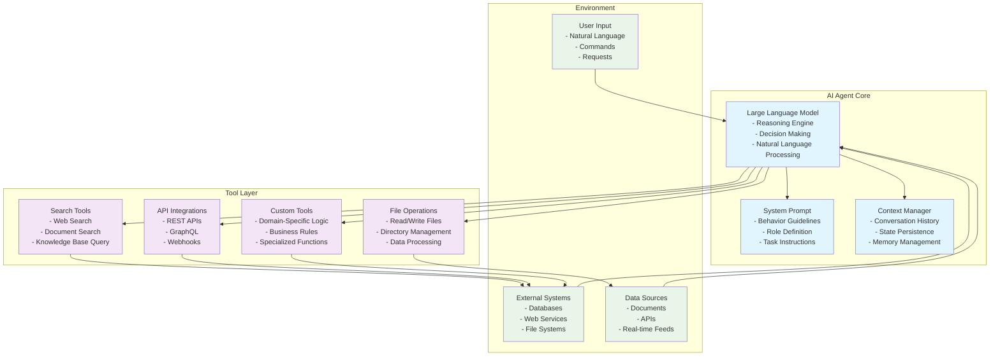
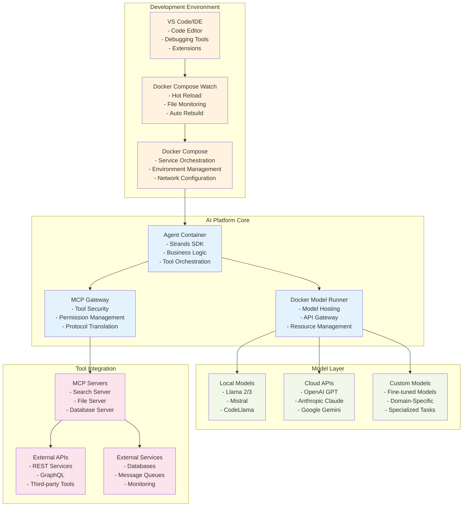
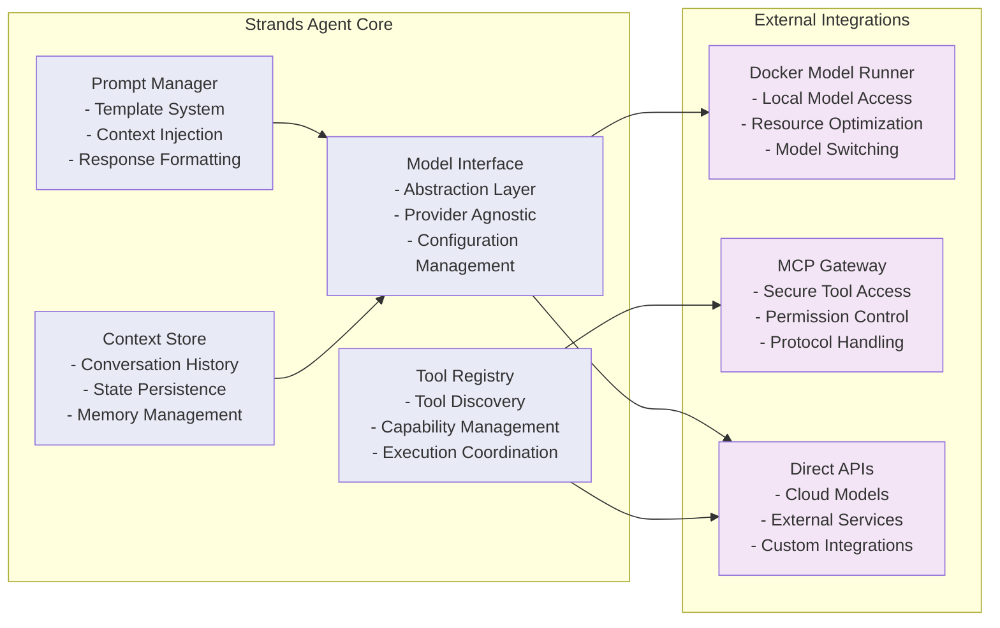
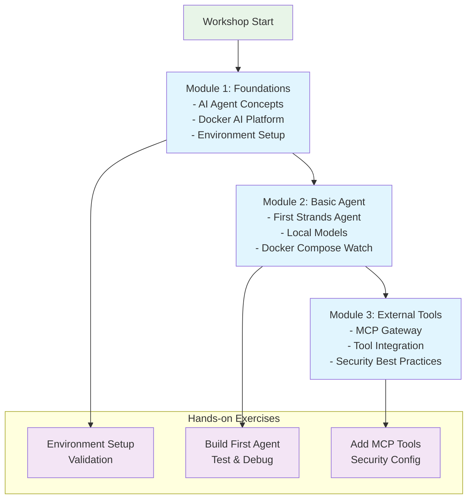
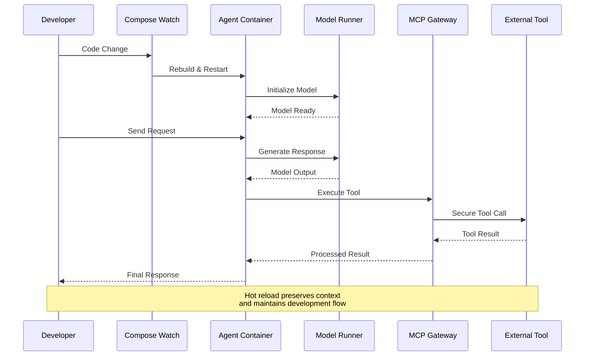
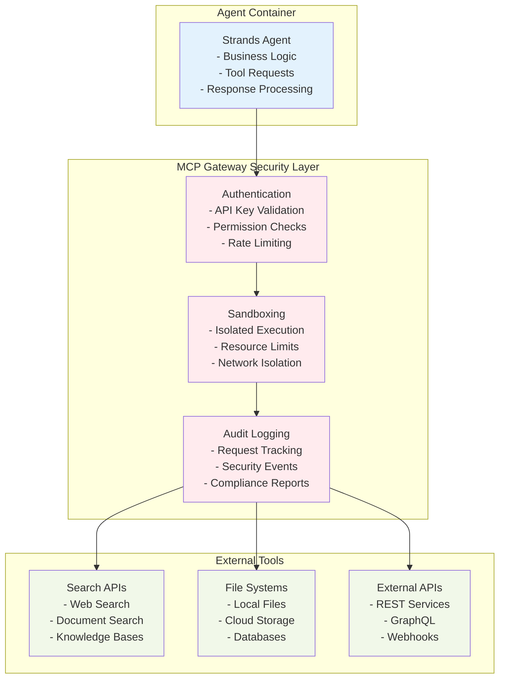

# Module 1: Visual Diagrams and Architecture

This file contains all the visual diagrams used in Module 1 for easy reference and reuse.

## AI Agent Architecture Diagram

## Docker AI Platform Architecture

## Strands SDK Component Architecture

## Workshop Learning Flow

## Docker AI Platform Component Interaction

## Security Architecture with MCP Gateway

