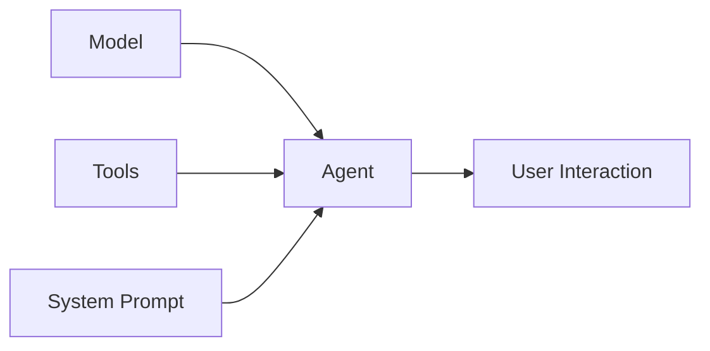

# Module 2: Basic Agent Development

**Duration:** 45 minutes  
**Prerequisites:** Module 1 completed, Docker Desktop with AI features enabled

## Overview

In this module, you'll build your first AI agent using the Strands SDK and Docker's AI platform. We'll start with the fundamentals and progressively add functionality, demonstrating best practices for agent development and containerization.

## Learning Objectives

By the end of this module, you will:
- ✅ Understand the three pillars of Strands agent architecture
- ✅ Build a working AI agent with local model integration
- ✅ Use Docker Model Runner for local AI model execution
- ✅ Implement Docker Compose Watch for efficient development
- ✅ Create and integrate custom tools for agent functionality
- ✅ Handle errors and debug agent issues effectively

## Part 1: Understanding Agent Architecture (10 minutes)

### The Three Pillars of Strands Agents

Every Strands agent is built on three fundamental components:



#### 1. **Model**: The AI Brain
The model is the core intelligence of your agent. It processes inputs, makes decisions, and generates responses.

```python
from strands.models.openai import OpenAIModel

model = OpenAIModel(
    client_args={
        "api_key": "sk-insecure",  # Dummy key for local models
        "base_url": MODEL_RUNNER_URL  # Docker Model Runner endpoint
    },
    model_id="ai/gemma3:1B-Q4_K_M",  # Local model identifier
    params={
        "temperature": 0.1,  # Lower = more deterministic
        "max_tokens": 500    # Response length limit
    }
)
```

#### 2. **Tools**: Agent Capabilities
Tools extend your agent's abilities beyond text generation. They're Python functions that the agent can call.

```python
from strands import tool

@tool
def current_time(timezone: str = "UTC") -> str:
    """Get the current time in a specific timezone."""
    from datetime import datetime
    import pytz
    
    tz = pytz.timezone(timezone)
    current = datetime.now(tz)
    return current.strftime("%Y-%m-%d %H:%M:%S %Z")
```

#### 3. **System Prompt**: Agent Personality and Instructions
The system prompt defines how your agent behaves, what it knows, and how it should use its tools.

```python
system_prompt = """
You are a helpful assistant with access to real-time information.

## Tool Usage Guidelines
- Use current_time() when user asks about time, date, or 'now'
- For specific timezones, use current_time(timezone='<timezone>')
- Always call current_time when time/date is relevant to the question

## Response Rules
1. Be concise but informative
2. Use tools when appropriate
3. Present information in user-friendly format
"""
```

### Putting It All Together

```python
from strands import Agent

agent = Agent(
    model=model,           # The AI brain
    tools=[current_time],  # Available capabilities
    system_prompt=system_prompt  # Behavior instructions
)

# Use the agent
response = agent("What time is it in Tokyo?")
print(response)
```

## Part 2: Docker Model Runner Integration (15 minutes)

### Why Docker Model Runner?

Docker Model Runner provides several key benefits:
- **Local execution**: No API keys or internet required
- **OpenAI compatibility**: Works with existing OpenAI-based code
- **Model management**: Automatic downloading and caching
- **Resource control**: Configurable memory and CPU usage

### Configuration in Docker Compose

The magic happens in your `compose.yaml` file:

```yaml
services:
  agent:
    build: .
    # Docker AI Platform Integration
    models:
      llm:  # Logical name for the model service
        endpoint_var: MODEL_RUNNER_URL    # Environment variable for API endpoint
        model_var: MODEL_RUNNER_MODEL     # Environment variable for model name

# Model specification
models:
  llm:
    model: ai/gemma3:1B-Q4_K_M  # Model to download and run
    context_size: 8192          # Token limit for conversations
```

### How It Works

1. **Docker Compose** reads the model specification
2. **Docker Model Runner** downloads the model (first run only)
3. **Model Runner** starts an OpenAI-compatible API server
4. **Your agent** connects to the local API endpoint
5. **Environment variables** provide connection details automatically

### Available Models

| Model | Size | Best For | Speed |
|-------|------|----------|-------|
| `ai/gemma3:1B-Q4_K_M` | ~1GB | Quick responses, simple tasks | Fast |
| `ai/qwen3:1.5B-Q4_K_M` | ~1.5GB | General purpose, good balance | Medium |
| `ai/llama3.2:3B-Q4_K_M` | ~3GB | Complex reasoning, detailed responses | Slower |

## Part 3: Building Your First Agent (15 minutes)

Let's build a practical agent step by step. We'll create a "Research Assistant" that can search for information and save findings.

### Step 1: Set Up the Project Structure

```bash
mkdir my-research-agent
cd my-research-agent
```

### Step 2: Create the Dependencies File

Create `pyproject.toml`:

```toml
[project]
name = "research-agent"
version = "0.1.0"
dependencies = [
    "strands",
    "strands-tools",
    "requests",
    "pytz"
]

[build-system]
requires = ["setuptools", "wheel"]
build-backend = "setuptools.build_meta"
```

### Step 3: Implement the Agent

Create `agent.py`:

```python
#!/usr/bin/env python3
"""
Research Assistant Agent

This agent can search for information and save research findings.
It demonstrates core Strands concepts with practical functionality.
"""

import os
from strands import Agent, tool
from strands.models.openai import OpenAIModel
from strands_tools import current_time

# Configuration
MODEL_RUNNER_URL = os.getenv("MODEL_RUNNER_URL", "http://model-runner.docker.internal/engines/llama.cpp/v1")
MODEL_RUNNER_MODEL = os.getenv("MODEL_RUNNER_MODEL", "ai/gemma3:1B-Q4_K_M")
RESEARCH_TOPIC = os.getenv("RESEARCH_TOPIC", "artificial intelligence trends 2024")

@tool
def search_information(query: str) -> str:
    """Search for information about a topic. Returns relevant information."""
    # In a real implementation, this would call a search API
    # For this example, we'll return mock data
    mock_results = {
        "artificial intelligence": "AI is rapidly advancing with developments in large language models, computer vision, and robotics. Key trends include multimodal AI, edge computing integration, and ethical AI frameworks.",
        "machine learning": "Machine learning continues to evolve with transformer architectures, federated learning, and automated machine learning (AutoML) becoming mainstream.",
        "docker": "Docker has expanded beyond containerization to include AI-specific features like Model Runner, enabling local AI model execution with OpenAI-compatible APIs."
    }
    
    # Simple keyword matching for demo
    for keyword, info in mock_results.items():
        if keyword.lower() in query.lower():
            return f"Search results for '{query}':\n\n{info}"
    
    return f"Search results for '{query}':\n\nGeneral information about {query} - this would contain real search results in a production implementation."

@tool
def save_research(filename: str, content: str) -> str:
    """Save research findings to a file."""
    try:
        # Ensure the research directory exists
        os.makedirs("/app/research", exist_ok=True)
        
        filepath = f"/app/research/{filename}"
        with open(filepath, "w") as f:
            f.write(content)
        
        return f"✅ Research saved to {filename}"
    except Exception as e:
        return f"❌ Error saving research: {e}"

def main():
    """Main agent execution function."""
    print("🔬 Research Assistant Agent Starting...")
    print(f"📋 Research Topic: {RESEARCH_TOPIC}")
    
    # Initialize the model
    model = OpenAIModel(
        client_args={
            "api_key": "sk-insecure",
            "base_url": MODEL_RUNNER_URL
        },
        model_id=MODEL_RUNNER_MODEL,
        params={
            "temperature": 0.3,  # Slightly creative for research
            "max_tokens": 800
        }
    )
    
    # Create the agent
    agent = Agent(
        model=model,
        tools=[search_information, save_research, current_time],
        system_prompt="""
You are a Research Assistant AI with access to search and file-saving capabilities.

## Your Role
- Research topics thoroughly using available tools
- Organize findings into clear, structured reports
- Save important information for future reference

## Tool Usage Guidelines
- Use search_information() to gather data about topics
- Use save_research() to save important findings
- Use current_time() to timestamp your research
- Always search before providing information

## Research Process
1. Search for information about the requested topic
2. Analyze and synthesize the findings
3. Create a structured summary
4. Save the research with a descriptive filename

## Response Format
- Start with a brief overview
- Include key findings with bullet points
- End with actionable insights or conclusions
- Always save your research for future reference
"""
    )
    
    # Research prompt
    research_prompt = f"""
Please research the topic: {RESEARCH_TOPIC}

I need you to:
1. Search for current information about this topic
2. Provide a comprehensive summary of key findings
3. Save the research to a file with today's date
4. Include the current timestamp in your research

Please be thorough and organize the information clearly.
"""
    
    try:
        print("🔄 Starting research...")
        response = agent(research_prompt)
        print(f"\n📊 Research Complete:\n{response}")
        
    except Exception as e:
        print(f"❌ Research failed: {e}")
        print("💡 Check that Docker Model Runner is available and the model is loaded")

if __name__ == "__main__":
    main()
```

### Step 4: Create the Dockerfile

Create `Dockerfile`:

```dockerfile
# Use Python 3.12 slim image for efficiency
FROM python:3.12-slim

# Prevent Python from buffering stdout/stderr
ENV PYTHONUNBUFFERED=1

# Install system dependencies
RUN apt-get update && apt-get install -y \
    build-essential \
    && rm -rf /var/lib/apt/lists/*

# Install uv for fast Python package management
RUN pip install uv

# Set working directory
WORKDIR /app

# Copy dependency specification
COPY pyproject.toml ./

# Install Python dependencies
RUN uv pip install --system .

# Copy application code
COPY agent.py .

# Create research output directory
RUN mkdir -p /app/research

# Run the agent
CMD ["python", "agent.py"]
```

### Step 5: Create Docker Compose Configuration

Create `compose.yaml`:

```yaml
# Research Assistant Agent - Docker Compose Configuration
services:
  research-agent:
    build: .
    
    # Environment variables
    environment:
      - RESEARCH_TOPIC=artificial intelligence trends 2024
    
    # Mount research output directory
    volumes:
      - ./research:/app/research
    
    # Docker AI Platform Integration
    models:
      llm:
        endpoint_var: MODEL_RUNNER_URL
        model_var: MODEL_RUNNER_MODEL
    
    # Development configuration with hot reload
    develop:
      watch:
        - action: sync+restart
          path: .
          target: /app
          ignore:
            - __pycache__/
            - research/
        - action: rebuild
          path: ./pyproject.toml

# Model configuration
models:
  llm:
    model: ai/gemma3:1B-Q4_K_M
    context_size: 8192
```

### Step 6: Test Your Agent

```bash
# Create the research output directory
mkdir research

# Build and run the agent
docker compose up --build

# Check the saved research
ls -la research/
cat research/*.txt
```

## Part 4: Docker Compose Watch Development Workflow (5 minutes)

### Why Use Docker Compose Watch?

Traditional development cycle:
1. Make code changes
2. Stop container
3. Rebuild image
4. Start container
5. Test changes

With Docker Compose Watch:
1. Make code changes
2. Changes sync automatically
3. Container restarts automatically
4. Test immediately

### Setting Up Watch Mode

Your `compose.yaml` already includes the watch configuration:

```yaml
develop:
  watch:
    - action: sync+restart  # Sync files and restart service
      path: .               # Watch current directory
      target: /app          # Sync to container directory
      ignore:               # Don't sync these
        - __pycache__/
        - research/
    - action: rebuild       # Rebuild on dependency changes
      path: ./pyproject.toml
```

### Using Watch Mode

```bash
# Start in watch mode
docker compose watch

# Now make changes to agent.py - the container will restart automatically
# Try changing the system prompt or adding a new tool
```

### Watch Mode Best Practices

1. **Ignore output directories**: Don't sync generated files back to host
2. **Rebuild on dependency changes**: Watch `pyproject.toml` for new packages
3. **Use sync+restart for code**: Faster than full rebuilds
4. **Monitor logs**: Watch the output to see when restarts happen

## Hands-On Exercise: Enhance Your Agent

Now it's your turn! Enhance the research agent with additional functionality:

### Exercise 1: Add a Calculator Tool

Add this tool to your agent:

```python
@tool
def calculate(expression: str) -> str:
    """Safely calculate mathematical expressions."""
    try:
        # Simple validation - only allow basic math
        allowed_chars = set('0123456789+-*/.() ')
        if not all(c in allowed_chars for c in expression):
            return "Error: Only basic math operations allowed"
        
        result = eval(expression)
        return f"Calculation: {expression} = {result}"
    except Exception as e:
        return f"Calculation error: {e}"
```

### Exercise 2: Modify the Research Topic

Change the environment variable and test:

```bash
RESEARCH_TOPIC="quantum computing applications" docker compose up --build
```

### Exercise 3: Experiment with Models

Try different models by editing `compose.yaml`:

```yaml
models:
  llm:
    model: ai/qwen3:1.5B-Q4_K_M  # Try this larger model
    context_size: 8192
```

## Key Takeaways

1. **Agent Architecture**: Model + Tools + System Prompt = Powerful AI Agent
2. **Docker Integration**: Model Runner makes local AI development seamless
3. **Development Workflow**: Compose Watch enables rapid iteration
4. **Tool Design**: Well-documented tools with clear purposes work best
5. **Error Handling**: Always include try/catch blocks and helpful error messages

## Next Steps

In Module 3, you'll learn to:
- Integrate real external APIs using MCP Gateway
- Implement secure credential management
- Build more sophisticated tool chains
- Handle complex agent interactions

## Troubleshooting

### Common Issues

**Agent won't start:**
- Check Docker Desktop is running with AI features
- Verify model is downloading: `docker compose logs`

**Tools not working:**
- Ensure tool functions have proper `@tool` decorator
- Check tool docstrings are descriptive
- Verify tools are added to agent's tools list

**Model responses are poor:**
- Try adjusting temperature (0.1 = deterministic, 0.7 = creative)
- Improve system prompt with more specific instructions
- Consider using a larger model

**Hot reload not working:**
- Ensure you're using `docker compose watch`
- Check file paths in watch configuration
- Verify files aren't being ignored

Ready to move on? Let's dive into external tool integration in Module 3!