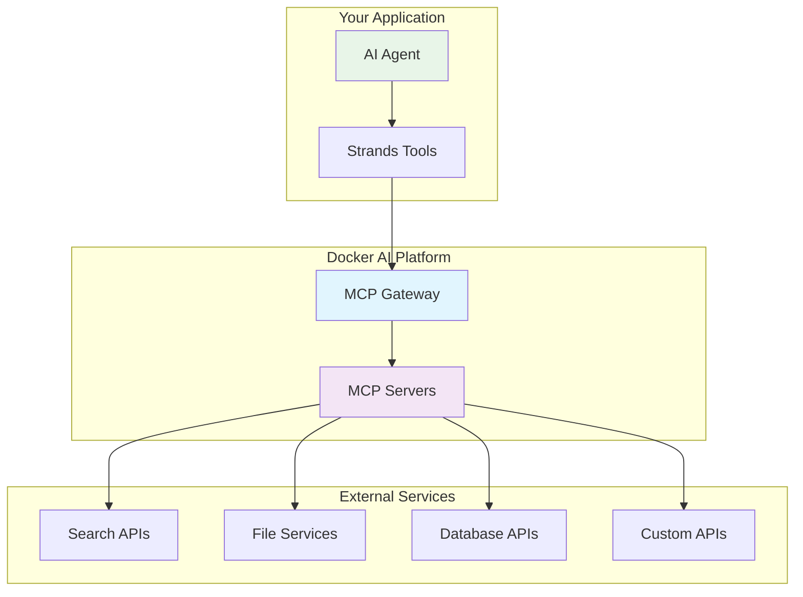

# Module 3: External Tool Integration with MCP Gateway

**Duration:** 45 minutes  
**Prerequisites:** Module 2 completed  
**Learning Objectives:** Understand MCP Gateway security, integrate external tools, manage Docker secrets

## Overview

In this module, you'll learn how to extend your AI agents with external capabilities using the Model Context Protocol (MCP) Gateway. This powerful Docker AI platform component provides secure, controlled access to external APIs and services while maintaining proper security boundaries.

## What is MCP Gateway?

The Model Context Protocol (MCP) Gateway is a security-focused service that acts as a bridge between your AI agents and external tools. Instead of your agents directly calling external APIs, they communicate through the MCP Gateway, which provides several critical benefits:

### Security Benefits

1. **Credential Isolation**: API keys and secrets are managed centrally by the gateway, not embedded in agent code
2. **Network Security**: All external calls are routed through a controlled, monitored gateway
3. **Rate Limiting**: Built-in protection against API abuse and quota exhaustion
4. **Tool Sandboxing**: External tools are validated and contained within secure boundaries
5. **Audit Logging**: All external tool usage is logged for security monitoring and compliance
6. **Access Control**: Fine-grained permissions control which tools agents can access

### Architecture Overview



## MCP Gateway Setup

### Basic Configuration

The MCP Gateway is configured through Docker Compose with command-line arguments that control its behavior:

```yaml
services:
  mcp-gateway:
    image: docker/mcp-gateway:latest
    use_api_socket: true
    command:
      - --transport=sse              # Server-Sent Events for real-time communication
      - --servers=duckduckgo         # Enable DuckDuckGo search server
      - --tools=search               # Expose search functionality
```

### Transport Options

MCP Gateway supports two transport mechanisms:

1. **Server-Sent Events (SSE)** - Recommended for most use cases
   - Real-time bidirectional communication
   - Works well with web-based agents
   - Better error handling and reconnection

2. **Standard I/O (stdio)** - For direct process communication
   - Lower latency for simple use cases
   - Direct process-to-process communication

### Available MCP Servers

The gateway can connect to various MCP servers that provide different tool capabilities:

| Server | Tools Provided | Use Cases |
|--------|---------------|-----------|
| `duckduckgo` | Web search | Research, fact-checking, current information |
| `github` | Repository operations | Code analysis, issue management, PR creation |
| `slack` | Team communication | Notifications, channel management, messaging |
| `filesystem` | File operations | Document processing, file management |
| `database` | SQL operations | Data queries, reporting, analytics |

### Tool Exposure Control

You can control which tools are available to your agents:

```yaml
command:
  - --servers=duckduckgo,github      # Multiple servers
  - --tools=search,github_api        # Specific tools only
```

## Enhanced Agent Implementation

Let's examine the enhanced agent-docker-v7 example that demonstrates MCP Gateway integration:

### Agent Structure

```python
#!/usr/bin/env python3
"""
Advanced Strands AI Agent with MCP Gateway Integration (v7)
"""

import os
from pathlib import Path
from mcp.client.sse import sse_client
from strands import Agent, tool
from strands.tools.mcp import MCPClient
from strands.models.openai import OpenAIModel

# MCP Gateway configuration
MCP_SERVER_URL = os.getenv("MCP_SERVER_URL", "http://mcp-gateway:8811/sse")
```

### Key Components Explained

#### 1. MCP Client Initialization

```python
# Initialize MCP Gateway connection
mcp_client = MCPClient(lambda: sse_client(MCP_SERVER_URL))

# Use context manager for proper resource management
with mcp_client:
    # Discover available tools from MCP Gateway
    mcp_tools = mcp_client.list_tools_sync()
```

**Why this matters:**
- Context manager ensures proper connection cleanup
- Tool discovery is dynamic - you get whatever tools the gateway exposes
- Connection is established once and reused for all tool calls

#### 2. Tool Integration

```python
# Combine MCP-provided external tools with custom local tools
all_tools = mcp_tools + [save_definition]

agent = Agent(
    model=model,
    tools=all_tools,
    system_prompt="""You are an intelligent research assistant..."""
)
```

**Key benefits:**
- Mix external MCP tools with custom local tools
- Agent automatically knows how to use all available tools
- No need to manually configure each external API

#### 3. Custom Tool Implementation

```python
@tool
def save_definition(word: str, definition: str) -> str:
    """Save a word's definition to a text file."""
    try:
        out_dir = Path("/app/definitions")
        out_dir.mkdir(exist_ok=True)
        
        safe_word = "".join(c for c in word if c.isalnum() or c in (' ', '-', '_')).strip()
        file_path = out_dir / f"{safe_word}.txt"
        
        with open(file_path, "w", encoding="utf-8") as f:
            f.write(f"Definition of '{word}':\n")
            f.write("=" * (len(word) + 15) + "\n\n")
            f.write(definition.strip() + "\n")
        
        return f"✅ Definition saved to {file_path.name}"
        
    except Exception as e:
        return f"❌ Error saving definition: {str(e)}"
```

**Best practices demonstrated:**
- Proper error handling with try/catch
- File system safety with path sanitization
- Clear success/failure feedback
- Docker volume integration for persistence

## Docker Secrets Management

### Why Use Docker Secrets?

Traditional environment variables have security limitations:
- Visible in process lists
- Stored in container metadata
- Logged in various places
- Difficult to rotate

Docker secrets provide a more secure alternative:
- Encrypted at rest and in transit
- Only available to authorized services
- Mounted as files, not environment variables
- Support automatic rotation

### Setting Up Secrets

#### 1. Create Secret Files

```bash
# Create API key file
echo "your-openai-api-key-here" | docker secret create openai_api_key -

# Or from file
docker secret create openai_api_key ./openai-key.txt
```

#### 2. Configure Service to Use Secrets

```yaml
services:
  agent:
    build: .
    secrets:
      - openai_api_key
    environment:
      - OPENAI_API_KEY_FILE=/run/secrets/openai_api_key

secrets:
  openai_api_key:
    external: true
```

#### 3. Load Secrets in Application

```python
def load_secret(secret_name):
    """Load secret from Docker secrets mount point."""
    secret_path = f"/run/secrets/{secret_name}"
    try:
        with open(secret_path, 'r') as f:
            return f.read().strip()
    except FileNotFoundError:
        return None

# Use in application
api_key = load_secret('openai_api_key')
```

### Enhanced Compose Configuration with Secrets

```yaml
services:
  agent:
    build: .
    secrets:
      - openai_api_key
      - github_token
    environment:
      - MCP_SERVER_URL=http://mcp-gateway:8811/sse
      - OPENAI_API_KEY_FILE=/run/secrets/openai_api_key
      - GITHUB_TOKEN_FILE=/run/secrets/github_token
    depends_on:
      - mcp-gateway

  mcp-gateway:
    image: docker/mcp-gateway:latest
    use_api_socket: true
    secrets:
      - github_token
    command:
      - --transport=sse
      - --servers=duckduckgo,github
      - --tools=search,github_api
    environment:
      - GITHUB_TOKEN_FILE=/run/secrets/github_token

secrets:
  openai_api_key:
    external: true
  github_token:
    external: true
```

## Advanced MCP Gateway Configuration

### Rate Limiting and Security

```yaml
mcp-gateway:
  image: docker/mcp-gateway:latest
  command:
    - --transport=sse
    - --servers=duckduckgo,github
    - --tools=search,github_api
    - --rate-limit=100           # Requests per minute per client
    - --timeout=30               # Request timeout in seconds
    - --log-level=info           # Logging verbosity
    - --cors-origins=*           # CORS configuration
  environment:
    - MCP_CACHE_TTL=300          # Cache responses for 5 minutes
```

### Health Monitoring

```yaml
mcp-gateway:
  # ... other configuration
  healthcheck:
    test: ["CMD", "curl", "-f", "http://localhost:8811/health"]
    interval: 30s
    timeout: 10s
    retries: 3
```

### Persistent Configuration

```yaml
mcp-gateway:
  # ... other configuration
  volumes:
    - ./mcp-config:/etc/mcp      # Custom MCP server configurations
    - ./mcp-logs:/var/log/mcp    # Persistent logging
```

## Error Handling and Troubleshooting

### Common Issues and Solutions

#### 1. MCP Gateway Connection Failures

**Symptoms:**
- Agent fails to start with connection errors
- "Connection refused" messages

**Solutions:**
```python
try:
    mcp_client = MCPClient(lambda: sse_client(MCP_SERVER_URL))
    with mcp_client:
        mcp_tools = mcp_client.list_tools_sync()
except Exception as e:
    print(f"❌ MCP Gateway connection failed: {e}")
    print("💡 Troubleshooting tips:")
    print("   - Check that MCP Gateway service is running")
    print("   - Verify MCP_SERVER_URL is correct")
    print("   - Check Docker network connectivity")
    # Fallback to agent without MCP tools
    mcp_tools = []
```

#### 2. Tool Discovery Issues

**Symptoms:**
- No tools available from MCP Gateway
- Expected tools not showing up

**Solutions:**
```python
mcp_tools = mcp_client.list_tools_sync()
print(f"📋 Available MCP tools: {[tool.name for tool in mcp_tools]}")

if not mcp_tools:
    print("⚠️  No MCP tools discovered")
    print("💡 Check MCP Gateway configuration:")
    print("   - Verify --servers parameter")
    print("   - Check --tools parameter")
    print("   - Review MCP Gateway logs")
```

#### 3. Secret Loading Failures

**Symptoms:**
- API authentication failures
- "Invalid API key" errors

**Solutions:**
```python
def load_secret_safely(secret_name, fallback_env=None):
    """Load secret with fallback to environment variable."""
    # Try Docker secret first
    secret_path = f"/run/secrets/{secret_name}"
    try:
        with open(secret_path, 'r') as f:
            value = f.read().strip()
            if value:
                return value
    except FileNotFoundError:
        pass
    
    # Fallback to environment variable
    if fallback_env:
        return os.getenv(fallback_env)
    
    return None

# Usage
api_key = load_secret_safely('openai_api_key', 'OPENAI_API_KEY')
if not api_key:
    print("❌ No API key found in secrets or environment")
```

### Debugging MCP Gateway

#### View Gateway Logs
```bash
# View real-time logs
docker compose logs -f mcp-gateway

# View specific number of recent log lines
docker compose logs --tail=50 mcp-gateway
```

#### Test Gateway Health
```bash
# Check if gateway is responding
curl http://localhost:8811/health

# Test SSE endpoint
curl -H "Accept: text/event-stream" http://localhost:8811/sse
```

#### Inspect Available Tools
```bash
# Connect to running agent container
docker compose exec agent python3 -c "
from mcp.client.sse import sse_client
from strands.tools.mcp import MCPClient
import os

mcp_client = MCPClient(lambda: sse_client(os.getenv('MCP_SERVER_URL')))
with mcp_client:
    tools = mcp_client.list_tools_sync()
    for tool in tools:
        print(f'Tool: {tool.name} - {tool.description}')
"
```

## Best Practices

### 1. Security
- Always use Docker secrets for API keys
- Implement proper error handling for secret loading
- Use rate limiting to prevent API abuse
- Monitor and log all external tool usage

### 2. Reliability
- Implement connection retry logic
- Use health checks for MCP Gateway
- Provide fallback behavior when tools are unavailable
- Cache responses when appropriate

### 3. Development
- Use Docker Compose Watch for hot reload during development
- Implement comprehensive logging for debugging
- Test with different MCP server configurations
- Validate tool availability before agent execution

### 4. Production
- Use external secrets management systems
- Implement monitoring and alerting
- Configure appropriate resource limits
- Plan for secret rotation procedures

## Summary

In this module, you learned:

✅ **MCP Gateway Architecture**: Understanding the security and architectural benefits  
✅ **Tool Integration**: How to connect external tools through MCP Gateway  
✅ **Docker Secrets**: Secure credential management in containerized environments  
✅ **Error Handling**: Robust patterns for handling MCP and tool failures  
✅ **Best Practices**: Security, reliability, and development recommendations  

The MCP Gateway provides a powerful, secure way to extend your AI agents with external capabilities while maintaining proper security boundaries and operational control.

## Next Steps

In the next module, you'll learn about model flexibility - how to switch between local and cloud models based on your deployment needs and requirements.